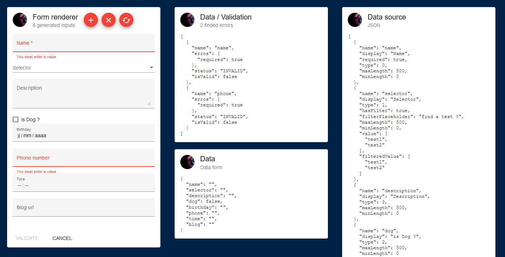

```bash
$ npm install --save @sheol/master-form
```

```json
// package.json

"dependencies": {
  "master-form": "@sheol/master-form",
  "ngx-mat-select-search": "^3.1.2",
}
```

## Master form

```html
<master-form 
  (onInit)="onInit($event)"
  (onData)="onData($event)"
  (onValidate)="validate($event)"
  (onError)="onError($event)"
  [data]=data 
  [forms]=masterForms></master-form>
```

```ts
export enum MasterFormType {
    INPUT,
    SELECT,
    CHECKBOX,
    TEXTAREA
}

export declare interface MasterFormCustomField {
    sourceField: string,
    idField: string
}

export declare interface MasterForm {
    name: string;
    display: string;
    placeholder?: string;
    controls?: ValidatorFn | ValidatorFn[];
    required?: boolean;
    type?: MasterFormType;
    inputType?: 'color' | 'date' | 'datetime-local' | 'email' | 'month' | 'number' | 'password' | 'search' | 'tel' | 'text' | 'time' | 'url' | 'week';
    isMultiselect?: boolean;
    hasIcon?: boolean;
    icon?: string;
    hasFilter?: boolean;
    filterCtrl?: FormControl;
    filterPlaceholder?: string;
    filterNoEntries?: string;
    errorMessageFunction?: (formControl: FormControl) => string;
    onInput?: (formControl: FormControl, target: any) => void;
    minLength?: number;
    maxLength?: number;
    data?: () => Observable<any>;
    customDataField?: MasterFormCustomField;
    value?: any[];
    filteredValue?: any[];
}

export declare interface MasterFormHelperInterface<T> {
    onInit(data: T): void;
    validate(disabled: boolean): void;
    onData(data: T): void;
    onError?(erros: any[]): void;
}

public onInit(data: Site): void {
  this.uuid = data.uuid;
}

public validate(disabled: boolean): void {
  this.disabled = disabled;
}

public onData(data: Site): void {
  this.data = data;
}

public onError(errors: any[]): void {
  this.errors = errors.filter(error => !error.isValid);
}
```

```yml
name!: string # input name
display!: string # input display
placeholder?: string, default: '' # input placeholder
controls?: ValidatorFn || ValidatorFn[], default: null # default validation
required?: boolean, default: false
type?: MasterFormType, default: MasterFormType.INPUT # input type see MasterFormType
inputType?: string, default: "text" # (values: 'color' | 'date' | 'datetime-local' | 'email' | 'month' | 'number' | 'password' | 'search' | 'tel' | 'text' | 'time' | 'url' | 'week')
isMultiselect?: boolean, default: false # enable multi select
hasIcon?: boolean, default: false # had icon on input row
icon?: string, default: "" # icon value, see mat-icon
hasFilter?: boolean, default: false # enable filter in select list
filterCtrl?: FormControl, default: null
filterPlaceholder?: string, default: "" # select placeholder filter
filterNoEntries?: string, default: "" # default message when no show entries
errorMessageFunction?: (formControl: FormControl) => string, default: null # (see validators)
onInput?: (formControl: FormControl, target: any) => void, default: null
minLength?: number, default: 0
maxLength?: number, default: NUMBER.MAX
data?: () => Observable<any>, default: () => {} # select data source
customDataField?: MasterFormCustomField, default: null
value?: any[], default: [] # input value
filteredValue?: any[], default: value # (only on input SELECT)
```

## Example

```ts
MasterForm[] = [
{
  name: 'name',
  display: 'Nom',
  controls: Validators.required,
  required: true,
  errorMessageFunction: (formControl: FormControl) => formControl.hasError("required") ? "Vous devez rentrer une valeur" : ""
}, {
  name: 'id',
  display: 'Id',
  maxLength: 4,
  onInput: (formControl: FormControl, target: any) => formControl.setValue((isNaN(+target.value) ? '' : target.value))
}, {
  name: 'full_name',
  display: 'Nom complet',
  controls: Validators.required,
  required: true,
  errorMessageFunction: (formControl: FormControl) => formControl.hasError("required") ? "Vous devez rentrer une valeur" : ""
}, {
  name: 'is_truc',
  display: 'truc ?',
  type: MasterFormType.CHECKBOX
}, {
  name: 'array_multi_select',
  display: 'Plusieurs sélections sur une liste',
  type: MasterFormType.SELECT,
  hasFilter: true,
  filterPlaceholder: 'rechercher un élément',
  isMultiselect: true,
  controls: Validators.required,
  data: () => this.service.getList().pipe(map(result => result.map(r => r.name)))
}, {
  name: 'date',
  display: 'Date',
  inputType: 'date',
  controls: Validators.required,
  required: true,
  errorMessageFunction: (formControl: FormControl) => formControl.hasError("required") ? "Vous devez rentrer une valeur" : ""
}, {
  name: 'description',
  display: 'Description',
  type: MasterFormType.TEXTAREA
}
```